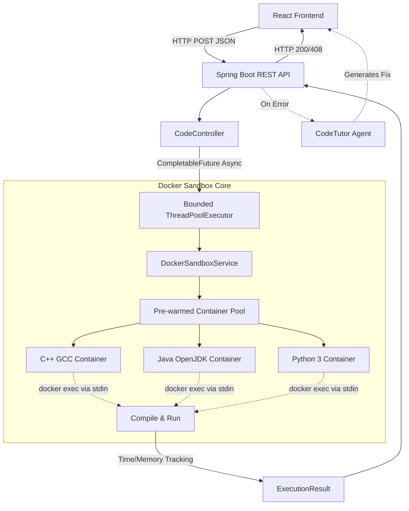

# CodeEngine

CodeEngine is a fast, secure, and smart code execution platform. It allows users to write and run C++, Java, and Python code directly in their browser. Everything runs securely inside isolated Docker environments, meaning it is safe, fast, and scalable.

## The Problem It Solves

Running code submitted by users on the internet is usually very dangerous. A normal web server cannot safely run random code because people could write infinite loops, use up all the server memory, or run malicious commands. 

CodeEngine solves this by acting as a highly secure sandbox. It puts every piece of code into a temporary, restricted box (a Docker container). It handles massive amounts of traffic smoothly and returns the output to the user almost instantly.

## Core Features

* **Multi-Language Support**: Compiles and runs Java, C++, and Python code.
* **Instant Auto-Heal (AI Integration)**: Automatically detects code errors and uses a smart AI assistant to fix them for you instantly.
* **Extreme Security**: Every execution happens inside an isolated, temporary container with strict memory and CPU limits.
* **High Performance**: Uses an asynchronous processing system to juggle thousands of concurrent requests without slowing down.

## How the AI is Integrated

We integrated Google's Gemini AI to serve as a built-in, lightning-fast "Code Tutor". 

When a user writes code and hits "Run", the engine attempts to compile and execute it. If the code crashes or fails to compile, the backend instantly intercepts the error output and sends the broken code alongside the error message to the AI agent.

The AI analyzes the exact point of failure, determines the correct solution, and returns a fixed version of the code along with a simple, human-readable explanation of what went wrong. The user is then presented with a clean comparison view where they can accept the AI's fix with a single click.

### Improvements for Users:
- **Zero Debugging Frustration**: Beginners no longer get stuck on confusing syntax errors or obscure stack traces.
- **Instant Learning**: The AI explains why the code broke, acting as a personal tutor.
- **Seamless Flow**: The one-click "Accept Fix" button means developers can keep writing code without breaking their focus to search for answers online.

## System Architecture



## Security & Sandboxing

Running untrusted user code natively is incredibly risky. This engine prevents that and ensures zero resource leakage through a very strict setup:

- **Pre-warmed Container Pool**: The system keeps idle containers ready at all times. Code is injected and run instantly. This avoids running anything directly on the host computer while skipping the slow startup times of new containers.
- **Strict Resource Limits**: Each container is tightly restricted so someone cannot exhaust the system's memory or crash the host with massive arrays.
- **Network Blackholing**: Container internet access is totally disabled. This stops the sandbox from being used for malicious network attacks.

## Quick Start

### 1. Requirements
- Docker and Docker Compose installed
- Maven and Java 21

### 2. Start the Stack
Bring up the frontend and backend simultaneously using Docker Compose:
```bash
docker-compose up -d --build
```

### 3. Usage
Navigate to `http://localhost:8080`, pick your language in the Code Editor, and run your code. To try the AI integration, intentionally write code with a syntax error and watch the Auto-Heal feature step in.