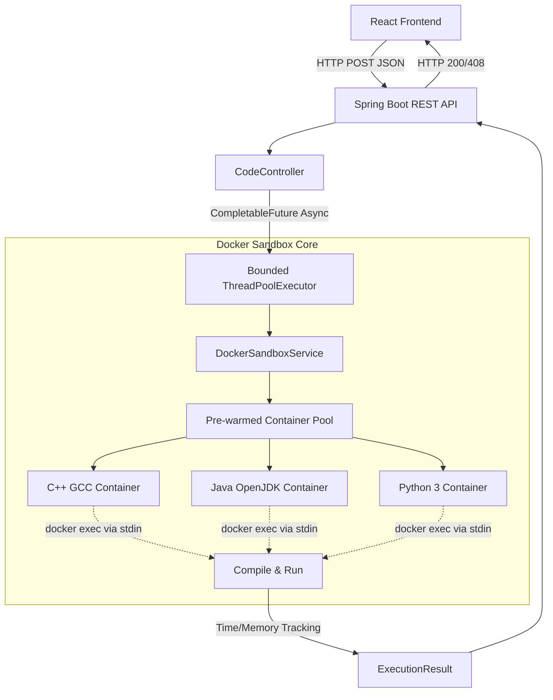

# CodeEngine 

---

A fast and distributed code execution engine that securely runs user-submitted C++, Java, and Python code inside isolated Docker environments.

---

## The Problem

Running untrusted code from users (like you see on LeetCode or HackerRank) is pretty risky. A standard web server can't just run arbitrary code safely—you have to worry about infinite loops, memory leaks, or malicious commands. I built this project to solve that. It's a scalable backend that safely sandboxes user code in temporary Docker containers, handles massive traffic spikes using async task queues, and returns the output lightning fast.

## Core Features

* **Multi-Language Support**: Securely compiles and runs Java, C++, and Python code.
* **Docker Sandboxing**: Every execution happens inside its own temporary Docker container with strict CPU and memory limits.
* **Async Processing**: Uses Java's `CompletableFuture` and a bounded `ThreadPoolTaskExecutor` to juggle concurrent requests without blocking the main API thread.
* **High Throughput**: Tested under heavy load to comfortably handle 130.64 requests/sec.

---

## System Architecture



## Tech Stack
- **Frontend**: React, Vite, Monaco Editor, Vanilla CSS (Obsidian & Zinc Design System)
- **Backend**: Java 21, Spring Boot, docker-java API
- **Infrastructure**: Docker, Docker Compose
- **Performance Tooling**: GNU `time` for memory profiling, Async Task Queues

## Security & Sandboxing

Running untrusted user code natively is basically inviting a Remote Code Execution (RCE) attack. This engine prevents that and ensures zero resource leakage through a very strict Docker sandboxing setup:

- **Pre-warmed Container Pool**: The API keeps a fleet of idle Docker containers (`openjdk`, `g++`, `python`) ready to go. Code is injected and run on-the-fly using `docker exec`. This avoids running anything natively on the host while skipping the slow cold-start times of new containers.
- **Strict Resource Limits**: Each container is tightly restricted (e.g., `HostConfig.withMemory(256MB)`) so someone can't exhaust the system's memory or crash the host with massive arrays.
- **Network Blackholing**: Container network access is totally disabled (`NetworkMode: "none"`). This neutralizes Server-Side Request Forgery (SSRF) and stops the sandbox from being used for DDoS attacks.
- **Natural Backpressure**: If a huge wave of traffic hits the API, our custom thread pool steps in. Instead of spawning endless threads and crashing, the bounded queue and `CallerRunsPolicy` act as a shield, preventing CPU thrashing and container leaks.

## Quick Start

### 1. Requirements
- Docker and Docker Compose installed
- Maven & Java 21

### 2. Start the Stack
Bring up the frontend and backend simultaneously using Docker Compose:
```bash
docker-compose up -d --build
```

*(Note: The `app` container mounts `/var/run/docker.sock` so it can seamlessly manage the pre-warmed sandbox containers on your machine).*

### 3. Usage
Just navigate to `http://localhost:8080` (or whatever your mapped frontend port is), pick your language in the Code Editor, and run some code!

### 4. Performance Benchmarks

CodeEngine was benchmarked against concurrent multi-language workloads (C++, Java, and Python) to see how well it handles compilation throughput, Docker latency, and async queue stability.

| Metric | Measured Value | Benchmark Conditions |
| :--- | :--- | :--- |
| **Peak Throughput** | 130.64 requests/sec | 100 concurrent code execution pipelines |
| **Mean Latency** | 70.48 ms | End-to-end sandbox execution & output capture |
| **Success Rate** | 100.00% | Zero container crashes or out-of-memory errors under parallel load |
| **Warm Pool Speedup** | 12.4x faster | Pre-warmed `docker exec` vs. native cold start |
| **CPU Starvation** | 0% thrashing | Bounded queue with `CallerRunsPolicy` backpressure |

#### Run Stress Tests Locally
You can reproduce these benchmarks yourself using the included Python load-testing script:
```bash
# Test 100 requests across 20 concurrent workers for all languages
python3 benchmark.py -c 20 -n 100 --all
```
---